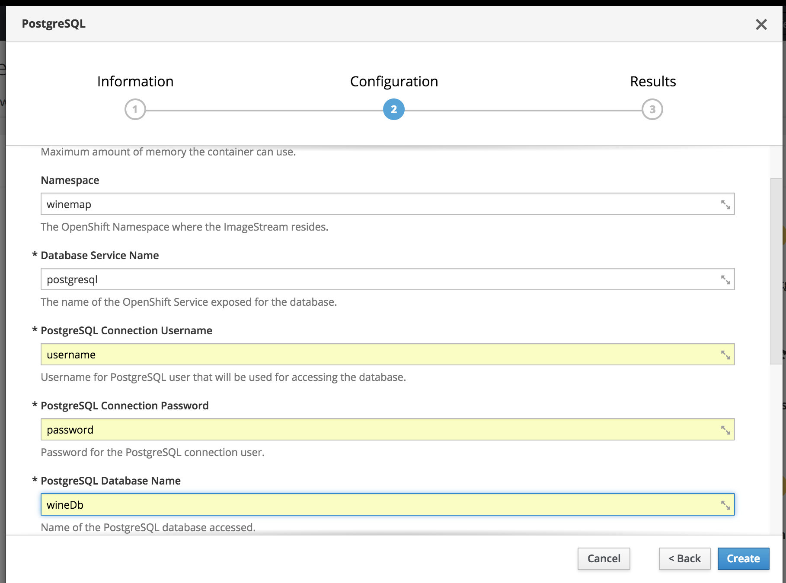
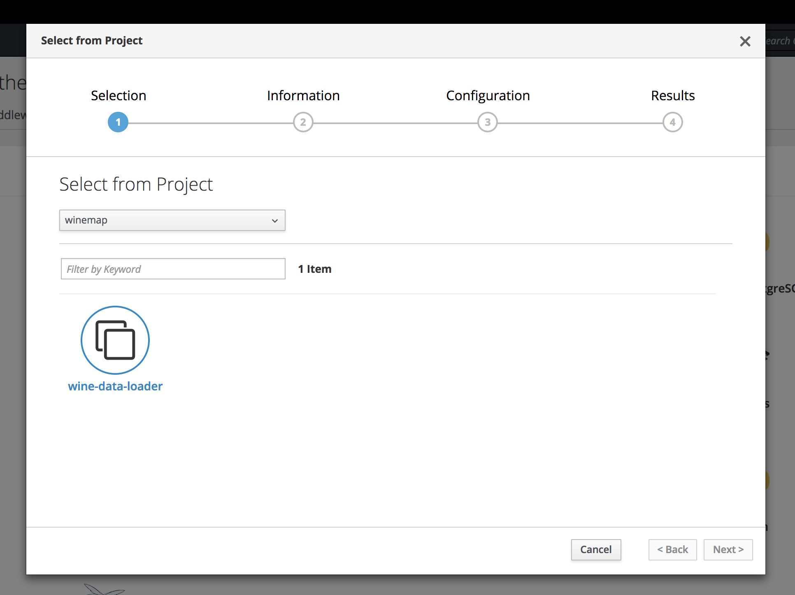
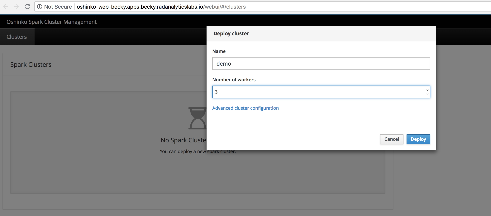
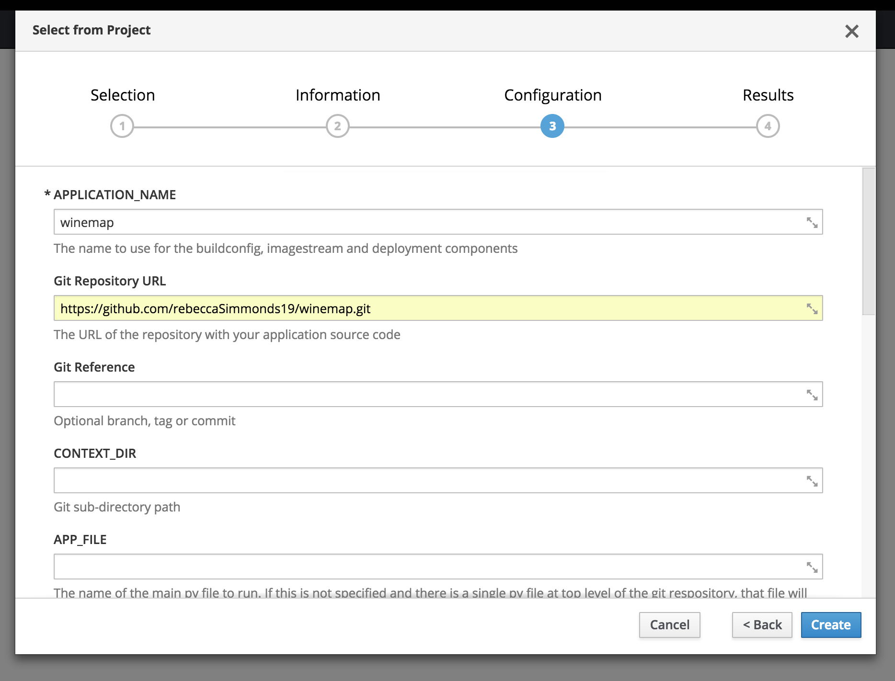
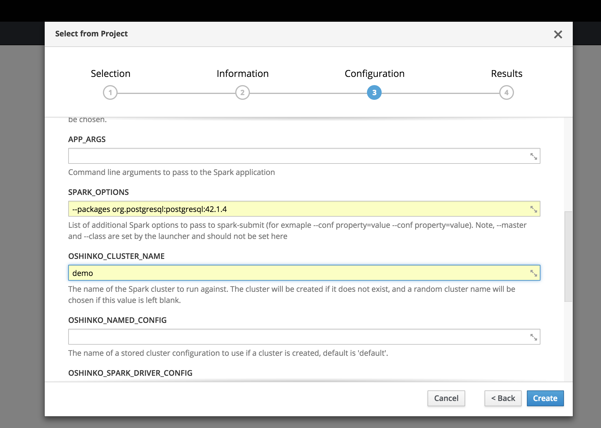
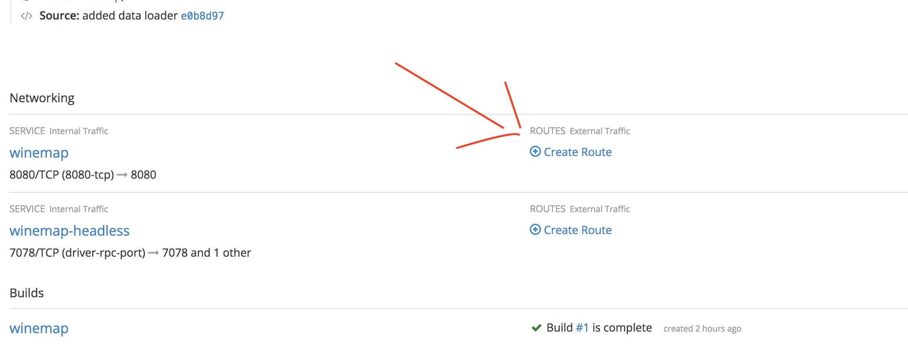

# How to Take Advantage of Microservice Architectures: Wine Map Use Case

This lab is intended to empower developers to create their own cloud native application and give them a look at microservice architectures. The application itself is made up of a database, an data processing application and a flask application server. The data is processed using an Apache Spark cluster (read more here:  deployed by the Oshinko webui (read more here https://radanalytics.io/get-started). The application will visulaise wine reviews on to a map so that traveling to countries with better wine is made easier. The microservices will be deployed onto an openshift cluster (read more here https://openshift.com), you will need to access this cluster by going to the following URL: https://console.becky.radanalyticslabs.io:8443/. Then login using the username you have been given.

Before you can deploy the application we will need to create an Apache Spark cluster for processing the data as well as a database to hold it.

# Creating a Database and Loading the Data

## Step 1 Deploy a database

In the console click the browse catalogue button and search for the postgresql database, click to make the new database. Click the next button this will show you the configuration page, here we will configure your database settings. In the configuration window make sure you enter the details show in the picture, do not worry about changing anything else. Click the create button and then close, you have deployed the first microservice a postgresql database.

## Step 2 Loading the Data

In the console go to the right hand side and you will see an “add to project” button, click on this and choose the “from project” option. We are going to use a data loader template to run a one time job and load the data into the database. The job is a kubernetes job, you can find out more about this at this link: http://kubernetesbyexample.com/jobs/
You will then be presented with the window below, select the wine-data-loader and click the next button. Click the next button twice and then the create button to make the job (you do not need to enter a job name as a random name will be generated from the template).

All the code for this section is stored in this repository:
https://github.com/radanalyticsio/winemap-data-loader

# Creating an Apache Spark Cluster using Oshinko

## Step 1 Create the Oshinko Webui

Go to the “add to project” button again and chose the “from project” option. Here you will chose the “oshinko-webui” option and click “next” button twice and then the “create” button to create the service.

## Step 2 Deploying an Apache Spark Cluster

Now you have created your Oshinko-webui you can click on the link shown in the picture below and go to the webui itself. One you are taken to the webui you can deploy your own Apache Spark cluster. To do this click the “deploy” button. Once you have done this you will be given the option to specify how many workers you want in you cluster. As this work isn’t very intensive we will specify 3 as shown in the picture below. You also have to name your cluster - this important so remember the name OR as in this example the cluster will be called "demo". Then click “finish” to deploy the cluster. If you go back to the overview of the project you will see the new spark nodes getting deployed. Once these have deployed we are ready to create our application. If you would like to read more about Apache Spark please visit this link: https://spark.apache.org/.

# Deploying the Application

Go to the console and to the “add to project” button and then chose the “from project” button. In this step we are going to make a python application that can speak to the Apache Spark cluster. Choose the “Apache Spark Python” image this will be used to set up our environment and make sure everything is installed for the app to run, such as python and Apache Spark. Click “next” twice this will bring you to the configuration page, this is where we enter the configuration for our application. Make sure to enter the details as shown below and then click create. You have now made your first cloud native application if you go to the link above the wine map application this will take you to the wine map - happy traveling!

To access the application you need to create a route, click on the link shown in the picture below and then click create (you do not need to enter any information to create the URL however you can rename it if you like). Click on the URL created above the winemap container and this will open the winemap for you.

Feel free to extend this app and go through other tutorials found at https://radanalytics.io

